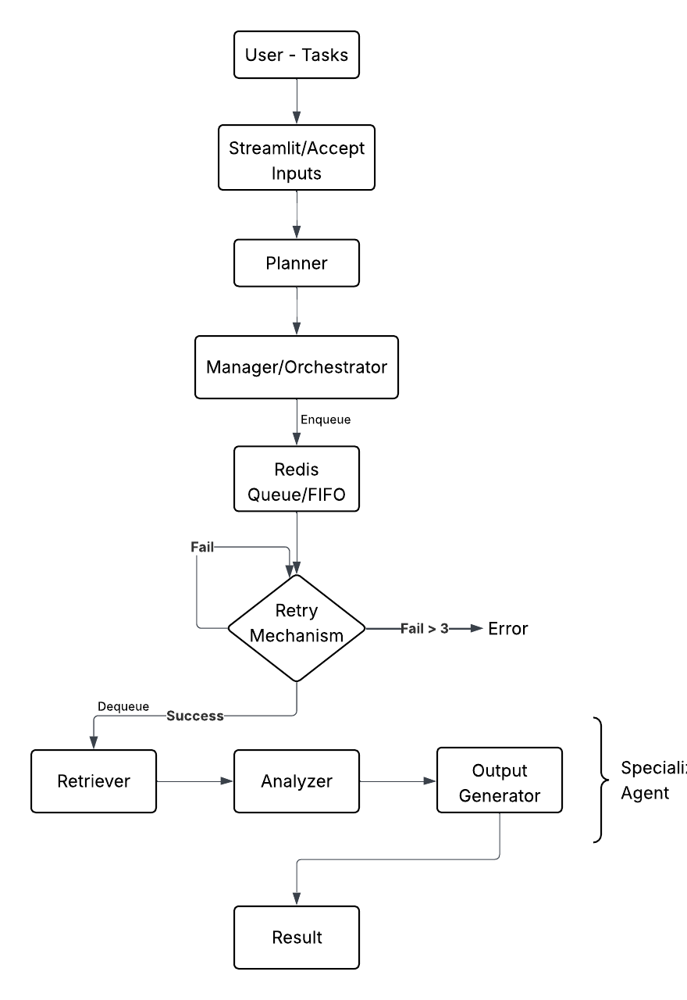

# 🚀 Agent-AI System

This project implements an Agentic AI System designed to handle multi-step tasks by decomposing them and coordinating multiple specialized agents using an asynchronous, queue-based architecture.

---

## 🖥️ How to Run the Project Locally

Follow the steps below to run the **Agentic-AI System** on your local machine.

---

## ✅ Prerequisites

Make sure you have the following installed:

- **Python 3.9+**
- **Git**
- **Gemini 1.5 Flash** or **Ollama** (for local LLM)
- A stable terminal (**VS Code recommended**)

---

# 1️⃣ Clone the Repository
```bash
git clone <your-github-repo-url>
cd AI-Agent-System
```

# 2️⃣ Install Dependencies
```bash
pip install -r requirements.txt
```

# 3️⃣ Install & Run Ollama Models
Make sure Ollama is running, then pull the required models:
```bash
ollama pull llama3
```

# 4️⃣ Project Structure:

```
AI-Agent_System/
│
├── app.py                 # Streamlit frontend (user input + streaming output)
├── planner.py             # Task classification & planning logic
├── manager.py             # Async orchestration, Redis queue, retries
├── redis_queue.py         # Redis push/pop queue utilities
├── batching.py            # Manual batching logic
├── ollama_client.py       # Ollama LLM interface
│
├── agents/
│   ├── doc_agent.py       # Document analysis agent (LLM + batching)
│   ├── code_agent.py      # Code review agent (LLM + batching)
│   └── web_agent.py       # Web research agent (search, scrape, LLM analysis)
│
├── requirements.txt       # Project dependencies
└── README.md              # Project documentation

```

# 5️⃣ Run the Application:
Run the command in terminal:
```bash
streamlit run app.py
```
The app will open automatically in your browser at:
http://localhost:8501

# 6️⃣ Demo Flow (What to Test)

Ask the system to do any task from the following:

1. Code Agent -
    Eg - Give any code and say "Review code"

2. Document Analysis - 
    Eg - Enter your document details for analysis
    This policy document describes how user data is stored and processed.
    User passwords are sometimes logged for debugging purposes.
    API keys are stored directly in configuration files.
    There is no regular security audit process in place.

3. Web Research Agent - 
    Eg - Ask "Research recent trends in AI"


# Architecture Explanation

## Planner & Task Decomposition

A Planner component interprets the user’s natural-language input and classifies it into a supported task type such as document analysis, code review, or web research. Based on this classification, the planner implicitly defines the sequence of steps required to complete the task.

- Converts unstructured input into structured task intent
- Defines which agents will be involved
- Keeps planning separate from execution

## Manager & Asynchronous Execution

The Manager/Orchestrator acts as the central coordination layer. It initializes the execution pipeline, manages retries, and streams partial progress updates to the user interface. Instead of executing tasks directly, the orchestrator enqueues work into a Redis message queue, enabling decoupled and asynchronous execution. All agent calls are wrapped in async/await logic to ensure non-blocking operation during I/O-heavy tasks such as LLM inference and web requests.

- Controls execution flow without performing reasoning
- Implements async execution and retry handling
- Streams real-time status updates to the UI

## Redis Message Queue

Redis is used as a lightweight message queue between the manager and agents. Tasks are pushed into Redis and later dequeued for execution, ensuring FIFO processing and isolation between orchestration and agent execution.

- Decouples task submission from execution
- Supports scalability and workload buffering

## Specialized Agents

The system uses multiple specialized agents, each with a single responsibility.

- Clear agent boundaries
- LLMs used as tools, not controllers
- Independent and replaceable components

## Manual Batching & LLM Usage

To improve efficiency and demonstrate scalability awareness, manual batching is implemented at the agent level. Inputs such as document chunks or web articles are explicitly grouped into fixed-size batches before being sent to the LLM. This batching logic is written manually in code, giving full control over batch size and execution behavior rather than relying on framework-level auto-batching.

- Explicit batching logic in code
- Reduced number of LLM calls
- Clear throughput vs latency trade-offs

## Architecture Flow 
 


## Scaling Issues

One scaling issue encountered was the use of a single Redis queue and a single worker execution loop. While this design is sufficient for demonstration and low concurrency, it can become a bottleneck under high load, as all agent tasks compete for the same queue and are processed sequentially. This limits throughput and increases latency when multiple tasks are submitted concurrently.

## Design Changes

A design decision that would be changed in a production setting is the use of a rule-based planner for task classification. Although this approach is simple and deterministic, it lacks flexibility and does not generalize well to diverse or ambiguous user inputs. In a real-world system, this component would be replaced with an LLM-based task router that generates structured execution plans dynamically, with validation enforced at the orchestration layer.

## Trade-offs made during development

Several trade-offs were made to balance clarity, reliability, and scope. The system prioritizes explicit orchestration and transparency over maximum performance, resulting in simpler but more understandable execution flow. Redis workers are embedded within the orchestrator to reduce deployment complexity, at the cost of true horizontal scalability. Additionally, document input is handled as pasted text instead of file uploads to keep the focus on agent coordination rather than data ingestion. These trade-offs were intentional to emphasize core agentic concepts while keeping the system lightweight and easy to explain.


